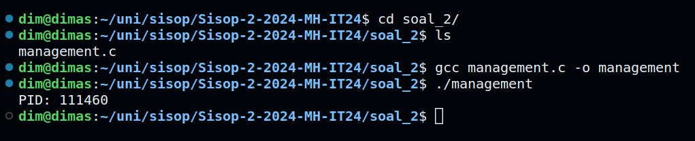
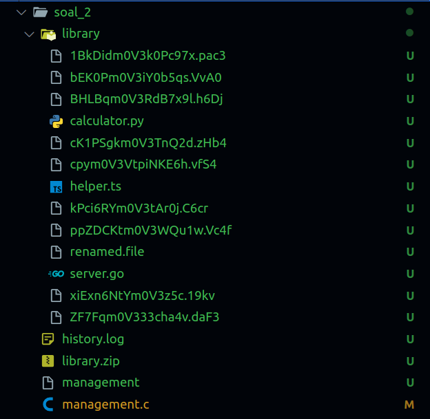
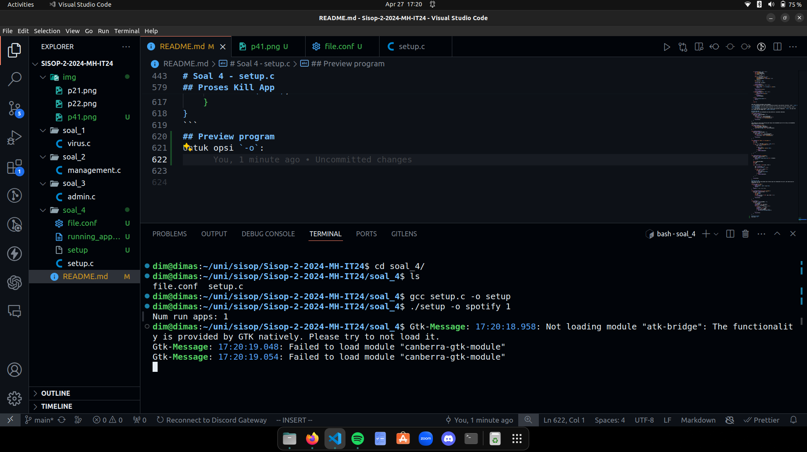
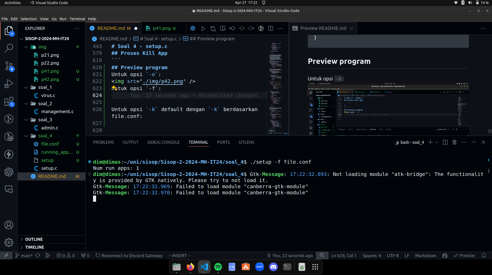
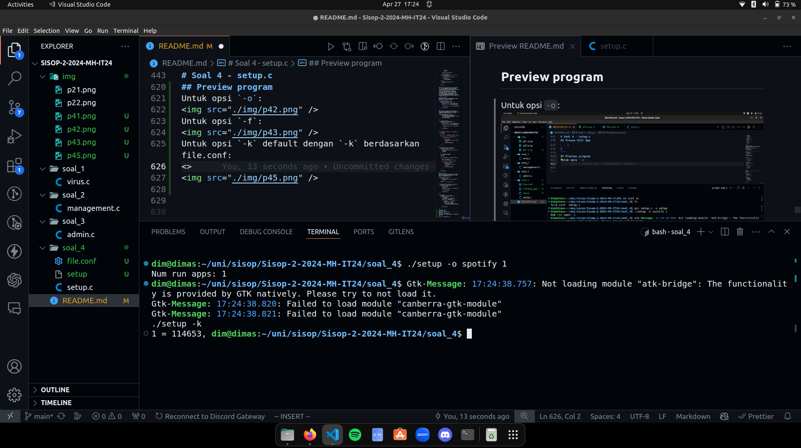
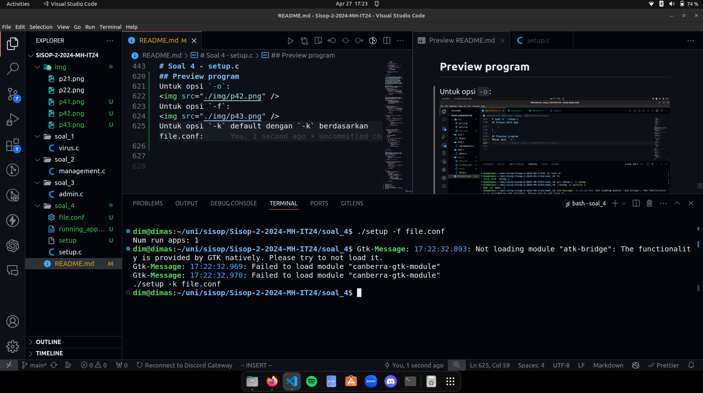

# Sisop Praktikum Modul 2-2024-MH-IT 24

Anggota Kelompok:

- Dimas Andhika Diputra 5027231074
- Mochamad Fadhil Saifullah 5027231068
- Thio Billy Amansyah 5027231007

# Soal 1 - virus.c

Pada soal berikut, diminta sebuah _executable_ bernamakan `virus` yang berisi beberapa function yang dapat melakukan kerja **find and replace** dan **report** terhadap beberapa flag yang berada pada file-file text dalam suatu folder.

```

	-- Do --
	gcc -g virus.c -o virus && ./virus /path/to/folder/

	-- Don't --
	gcc -g virus.c -o virus && ./virus /path/to/folder

```

Program akan berjalan setelah mengcompile source code lalu memasukkan file executable beserta jalur menuju folder yang berisikan file text yang akan dicek.

> **Perlu diperhatikan bahwa path menuju folder perlu diakhiri dengan `/` agar bisa bekerja dikarenakan salah satu bagian dari design source code yang mendapatkan path menuju file text dengan mengabungkan path menuju folder dengan nama dari file text.**

# Files

Beberapa nama berikut adalah bagian-bagian yang diperlukan untuk menjalakan program beserta deskripsi detailnya.

### Executable File

**File executable** yang didapatkan dari mengcompile source code yang berasal dari `virus.c`. Fungsinya adalah mendeteksi dan mengubah flag-flag yang telah ditentukan dalam file text. Berisikan binary yang bisa langsung dijalankan dalam sebuah terminal. Source code dibentuk dalam mesin Linux dan menggunakan library `<unistd.h>` sehingga akan lebih baik apabila file `exe` dijalankan dalam mesin yang sama untuk kelancaran.

### Text Files

File text hanya berisikan string yang akan menjadi input utama dari **virus**. Flag-flag yang berada dalam file ini adalah **`"m4LwAr3"`**, **`"5pYw4R3"`**, dan **`"R4nS0mWaR3"`**.

### /path/to/folder/

Path menuju folder ini menjadi input utama kedua yang diperlukan untuk mendapatkan file-file text di dalamnya. Input hanya dapat dimasukkan dengan cara direct, seperti `/path/to/folder/` dan `./path-to-folder/`. Ingat untuk memasukkan `/` pada akhir path dikarenakan oleh alasan yang telah dijelaskan pada pembukaan.

# Source Code

Terdapat beberapa function buatan yang penting dalam menjalankan fungsi utama dari program ini. Function tersebut dapat dilihat di bawah ini dengan judul berupa nama atau fungsi yang dijalankannya.

## Input Validation

```

	if (argc != 2) {
		printf("Error: invalid input\n\nUsage: ./virus ./path/to/input/\nPUT '/' AT THE END OF TARGET PATH LIKE THE EXAMPLE ABOVE\n");
		return 1;
	}

	--- Output ---
	Error: invalid input

	Usage: ./virus ./path/to/input/
	PUT '/' AT THE END OF TARGET PATH LIKE THE EXAMPLE ABOVE

```

Memastikan input `path` dapat diproses oleh program. Pengecekan dilakukan dengan menghitung jumlah argumen yang masuk dari terminal. Argumen yang kurang/lebih dari dua akan dinilai tidak valid. Argumen yang kurang tanda `/` pada akhir argumen kedua juga termasuk tidak valid.

## Redirect STDIN, STDOUT, STDERR to /dev/null in C

```

	for(int fd=0; fd<3; fd++) close(fd);
	open("/dev/null", O_RDONLY);
	open("/dev/null", O_WRONLY);
	open("/dev/null", O_WRONLY);

```

Berfungsi untuk menyembunyikan output apapun dari terminal dengan mengarahkan segala output (STDIN, STDOUT, STDERR) ke `/dev/null`.

## Fork()

```

	pid_t pid;
	pid = fork();
	if (pid == 0) {
		...
		...
		...
	} else if (pid != 0) { // stopping parent process
		printf("Ping: Wont open parent processes (%i)\n", pid);
		return 1;
	}

```

This bit is to make the program run in background by running it on child process and killing the parent process. Result is two `pid` where one with value of `0` is a child process while the other is the parent. Also that ping won't show during runtime, its just remnant of debugging process.

## Accessing All Entries

```

		...
		if (pid == 0) {
			DIR *dir;
			struct dirent *ent;
			char path[strlen(argv[1])+1]; //  add 1 for '\0' character.
			strcpy(path, argv[1]); // dont do 'char *path = argv[1]' cuz it copies the ptr adress of source (can change 'argv[1]' if 'path' is changed)

			if ((dir = opendir (argv[1])) != NULL) {
				...
				...
				...
			} else {	// could not open directory
				printf("Error: Cant open dir\n");
				return 1;
			}
		return 0;
	}

```

Using `<dirent.h>` library, this program can look over a folder and its contents. Specifically using `ent->d_name` from `struct dirent *ent` in the next section. Any important notes during debugging is in the source code as comments (aint typing allat back). Any non-null directory will be further processed, as ones that are, program won't do anything (prints error during debugging if that counts).

## Further Processing

```

		if ((dir = opendir (argv[1])) != NULL) {
			while ((ent = readdir (dir)) != NULL) {	// access all the files and directories within directory
				const char *fname = ent->d_name;
				if (strcmp(fname, ".") == 0 || strcmp(fname, "..") == 0) continue; // 'continue' will skip loop that opens "." and ".." directory
				strcat(path, fname);
				freplace(path, "m4LwAr3", "[MALWARE]");	// do find and replace operation
				freplace(path, "5pYw4R3", "[SPYWARE]");
				freplace(path, "R4nS0mWaR3", "[RANSOMWARE]");
				strcpy(path, argv[1]); // re-copy 'path' original value because strcat() change its value to strcat()'s result.
			}
			closedir (dir);
		} else...

```

Will first check if file is null/not. Non-null can be searched through using self-made function `freplace()`. But before that, the program will make a proper direct path to a file because it will be an important input for the function.

The `ent->d_name` will have a string value of the file name. This is the part where the 'why' of putting `/` at end of path is answered. As you can see, there is a `strcat()` function to assemble a direct link to the file. If there isn't `/` at end, the path would look like `/path/tofile` instead of `/path/to/file`.

Single mention of `continue` function can skip one loop from a currently working loop statement.

## freplace()

```
	int freplace(const char *path, char *trg, char *new) {
	  FILE *fp = fopen(path, "r");
	  int fsize;
	  fseek(fp, 0L, SEEK_END); // incrementing fsize while fgetc() is on a loop will result in stack overflow. Only stops at +/- 32000 byte or so.
		fsize = ftell(fp);

		char tmp[fsize];
		rewind(fp); // dont erase, will segfault. Caused by prev 'fgetc()' moving file pos indicator to end.

		// read file to a tmp array
		fread(tmp, sizeof tmp[0], fsize, fp);
		fclose(fp);

		// find 'n replace file
		fp = fopen(path,"w");
		replace(trg, new, tmp, fp, fsize, path);
		fclose(fp);

		return 0;
	}

```

Function does its thing by opening file in `r` mode (read) to measure file size. Then it read its content to a `temp[]` char array. Finally it uses all previously gained argument to do `find and replace` operation on the file, such as target string, replacement string, buffer text string, file pointer, file size, and direct path to file.

## replace()

```

	void replace(char *trg, char *new, char *tmp, FILE *fp, int fsize, const char *path) {
		int trg_len = strlen(trg);
		for(int i = 0; i < fsize ; i++) {
			// find target string
			if(tmp[i] == trg[0] && tmp[i+trg_len-1] == trg[trg_len-1] && tmp[i+trg_len/2] == trg[trg_len/2]) {
				fputs(new, fp);
				i = i + trg_len - 1;
				mark(path, trg, new);
			} else {
				fputc(tmp[i], fp);
			}
		}
	}

```

Records length of target string before doing printing and target check one character at a time to appointed text file. It checks the starting, middle, and end character between temp array and target array.

A match would print replacement string and skip writing from `tmp[]` array by how big/long the replacement string is.

## mark()

```

	void mark(const char *path, char *old, char *new) {
		FILE *freport = fopen("virus.log", "a");
		char ping[100];
		time_t t = time(NULL);
		struct tm loctm;
		localtime_r(&t, &loctm);

		// print report to char array
		strftime(ping, sizeof ping, "[%d-%m-%Y][%X]  Suspicious string at ", &loctm);
		fprintf(freport, "%s%s successfully replaced (%s -> %s)\n", ping, path, old, new);
		fclose(freport);	// missed this part and whole thing just doesnt work :VV
	}

```

Reports the findings in separate text file on single log file. Much of the past bugs is written as comments if you are interested in reading it.

# Soal 2 - management.c
Pertama2 mulai dari fungsi mainnya, program pertama membuat daemon dengan while terus menerus, print pidnya, kemudian menjalankan mode default dari program no 2
```c
int main(int argc, char *argv[]) {
    signal(SIGRTMIN, signal_handler);
    pid_t pid, sid;

    pid = fork();

    if (pid < 0) {
        exit(EXIT_FAILURE);
    }

    if (pid > 0) {
        exit(EXIT_SUCCESS);
    }

    umask(0);

    sid = setsid();
    if (sid < 0) {
        exit(EXIT_FAILURE);
    }

    if ((chdir("/")) < 0) {
        exit(EXIT_FAILURE);
    }

    printf("PID: %d\n", getpid());

    close(STDIN_FILENO);
    close(STDOUT_FILENO);
    close(STDERR_FILENO);

    while (1) {
        default_act();
        sleep(2024);
    }

    return 0;
}
```
di mode default sendiri pertama kita download dan extract library.zip setelah itu kita lakukan rename decrypt (ROT19) seluruh nama file yang ada di library. Jika pada nama file nya terdapat kata `r3N4mE` maka rename file berdasarkan extension, jika terdapat `d3Let3` maka hapus filenya, dan tersisa file yang sudah ter-rename dan file yang nama filenya mengandung kata `m0V3`

```c
int default_act() {
    int status;
    if (file_exist("library.zip") == 0) {
        pid_t download_child = fork();
        
        if (download_child == 0) {
            backup_mode = 0;
            char *argv[6] = {"Download", "--content-disposition", "https://docs.google.com/uc?export=download&id=1rUIZmp10lXLtCIH3LAZJzRPeRks3Crup", "-P", "/home/dim/uni/sisop/Sisop-2-2024-MH-IT24/soal_2", NULL};
            execv("/bin/wget", argv);
        }
        
    } 
    
    wait(&status);
    if (WIFEXITED(status)) {
        if (file_exist("history.log") == 0) {
            pid_t history_child = fork();
            if (history_child == 0) {
                char *argv[3] = {"make a history", "/home/dim/uni/sisop/Sisop-2-2024-MH-IT24/soal_2/history.log", NULL};
                execv("/bin/touch", argv);
            }
        
        }
    }

    wait(&status);
    if (WIFEXITED(status)) {
        if (file_exist("library") == 0) {
            pid_t unzip_child = fork();
            if (unzip_child == 0) {
                char *argv[5] = {"unzip", "/home/dim/uni/sisop/Sisop-2-2024-MH-IT24/soal_2/library.zip", "-d", "/home/dim/uni/sisop/Sisop-2-2024-MH-IT24/soal_2", NULL};
                execv("/bin/unzip", argv);
            }
        } else {
            pid_t lib_delete_child = fork();
            if (lib_delete_child < 0) {
                printf("garpu gagal");
                exit(EXIT_FAILURE);
            } else if (lib_delete_child == 0) {
                backup_mode = 0;
                if (file_exist("library.zip") != 0) {
                    pid_t del_childchild = fork();
                    if (del_childchild == 0) {
                        char *argv[4] = {"remove", "-rf", "/home/dim/uni/sisop/Sisop-2-2024-MH-IT24/soal_2/library", NULL};
                        execv("/bin/rm", argv);
                    }
                    wait(&status);
                    if (WIFEXITED(status)) {
                        pid_t zip_child = fork();
                        if (zip_child == 0) {
                            char *argv[5] = {"unzip", "/home/dim/uni/sisop/Sisop-2-2024-MH-IT24/soal_2/library.zip", "-d", "/home/dim/uni/sisop/Sisop-2-2024-MH-IT24/soal_2", NULL};
                            execv("/bin/unzip", argv);
                        } else {
                            wait(&status);
                            if (WIFEXITED(status)) {
                                rename_stuff();
                            }
                        }
                    }
                }
            }
        }
    }

    wait(&status);
    if (WIFEXITED(status)) {
        if (file_exist("library") != 0) {
            pid_t mkdir_child = fork();
            if (mkdir_child == 0) {
                char *argv[3] = {"making folder", "/home/dim/uni/sisop/Sisop-2-2024-MH-IT24/soal_2/library/backup", NULL};
                execv("/bin/mkdir", argv);
            }
        }
    }

    wait(&status);
    if (WIFEXITED(status)) {
        rename_stuff();
    }
    sleep(2024);
}
```
sebenarnya kebanyakan proses berada pada function `rename_stuff()` yang berisi logic dari decrypt ROT19 nya, dan seluruh operasi seperti rename dan delete.

```c
int rename_stuff() {
    char *basePath = "/home/dim/uni/sisop/Sisop-2-2024-MH-IT24/soal_2/library";
    struct dirent *dp;
    DIR *dir = opendir(basePath);

    while ((dp = readdir(dir)) != NULL) {
        if (default_mode == 1) {
            if (strcmp(dp->d_name, ".") != 0 && strcmp(dp->d_name, "..") != 0) {

            char to_change[500] = "/home/dim/uni/sisop/Sisop-2-2024-MH-IT24/soal_2/library/";
            char original_name[500] = "/home/dim/uni/sisop/Sisop-2-2024-MH-IT24/soal_2/library/";
            char text[100], ch;
            int key = 19;
            strcpy(text, dp->d_name);
                if (text[0] >= '0' && text[0] <= '9') {
                    if (strstr(dp->d_name, "d3Let3") != NULL) {
                        strcat(to_change, dp->d_name);
                        remove(to_change);
                        histlog(text, "delete");
                    } else if (strstr(text, "r3N4mE") != NULL) {
                        strcat(to_change, dp->d_name);
                        if (strstr(text, ".ts") != NULL) {
                            rename(to_change, "/home/dim/uni/sisop/Sisop-2-2024-MH-IT24/soal_2/library/helper.ts");
                            histlog("helper.ts", "rename");
                        } else if (strstr(text, ".py") != NULL) {
                            rename(to_change, "/home/dim/uni/sisop/Sisop-2-2024-MH-IT24/soal_2/library/calculator.py");
                            histlog("calculator.py", "rename");
                        } else if (strstr(text, ".go") != NULL) {
                            rename(to_change, "/home/dim/uni/sisop/Sisop-2-2024-MH-IT24/soal_2/library/server.go");
                            histlog("server.go", "rename");
                        } else {
                            rename(to_change, "/home/dim/uni/sisop/Sisop-2-2024-MH-IT24/soal_2/library/renamed.file");
                            histlog("renamed.file", "rename");
                        }
                    }
                } else {
                    for (int i = 0; text[i] != '\0'; ++i) {
                        ch = text[i];
                        if (isalnum(ch)) {
                            if (islower(ch)) {
                                ch = (ch - 'a' - key + 26) % 26 + 'a';
                            }
                            if (isupper(ch)) {
                                ch = (ch - 'A' - key + 26) % 26 + 'A';
                            }
                        }
                        text[i] = ch;
                    }
                    if (strstr(text, "d3Let3") != NULL) {
                        strcat(to_change, dp->d_name);
                        remove(to_change);
                        histlog(dp->d_name, "delete");
                    } else if (strstr(text, "r3N4mE") != NULL) {
                        strcat(to_change, dp->d_name);
                        if (strstr(text, ".ts") != NULL) {
                            rename(to_change, "/home/dim/uni/sisop/Sisop-2-2024-MH-IT24/soal_2/library/helper.ts");
                            histlog("helper.ts", "rename");
                        } else if (strstr(text, ".py") != NULL) {
                            rename(to_change, "/home/dim/uni/sisop/Sisop-2-2024-MH-IT24/soal_2/library/calculator.py");
                            histlog("calculator.py", "rename");
                        } else if (strstr(text, ".go") != NULL) {
                            rename(to_change, "/home/dim/uni/sisop/Sisop-2-2024-MH-IT24/soal_2/library/server.go");
                            histlog("server.go", "rename");
                        } else {
                            rename(to_change, "/home/dim/uni/sisop/Sisop-2-2024-MH-IT24/soal_2/library/renamed.file");
                            histlog("renamed.file", "rename");
                        }
                    } else if (strstr(text, "m0V3") != NULL) {
                        strcat(original_name, dp->d_name);
                        strcat(to_change, text);
                        rename(original_name, to_change);
                        histlog(dp->d_name, "rename");
                    }
                }  
            }
        }
        sleep(1);
    }
    closedir(dir);
}
```
dan terakhir terdapat fungsi utility tambahan yaitu `file_exist` dan `histlog`, di mana `file_exist` digunakan untuk mengecek apakah file ada pada direktori, sedangkan `histlog` digunakan untuk seluruh operasi log program

## Preview program
berikut preview terminal ketika dijalankan

dan struktur direktori nomor 2 akan menjadi seperti:



# Soal 4 - setup.c
Pertama2 mulai dari fungsi mainnya, program memiliki alur bekerja seperti berikut:
```c
	loadRunningApps();

    if (argc < 2) {
        printf("Usage: %s -o <app1> <num1> <app2> <num2> ... <appN> <numN> or %s -f <filename> or %s -k\n", argv[0], argv[0], argv[0]);
        exit(1);
    }

    if (strcmp(argv[1], "-o") == 0) {
        char *apps[MAX_APPS];
        int num_apps[MAX_APPS];
        int numArgs = argc - 3;

        int i, j, appIndex = 0;
        for (i = 2; i < argc; i += 2) {
            apps[appIndex] = argv[i];
            num_apps[appIndex] = atoi(argv[i + 1]);
            appIndex++;
        }
        apps[appIndex] = NULL;

        openApps(apps, num_apps);

        saveRunningApps();
    } else if (strcmp(argv[1], "-f") == 0) {
        if (argc != 3) {
            printf("Usage: %s -f <filename>\n", argv[0]);
            exit(1);
        }
        readConfigFile(argv[2]);

        saveRunningApps();
    } else if (strcmp(argv[1], "-k") == 0) {
        if (argc == 3) {
            killAppsFromFile(argv[2]);
        } else {
            killApps();
            remove(FILENAME);
        }
    } else {
        printf("Invalid option\n");
        exit(1);
    }

    return 0;
```

pada kode tersebut ada handler untuk argument:
-  `-o` yang digunakan untuk open program berdasarkan parameter yang diketikan setelahnya, contoh `./setup -o spotify 1 firefox 2`
- `-f` yang digunakan untuk open program berdasarkan file config yang kita ketikkan setelahnya, contoh `./setup -f file.conf`
- `-k` yang digunakan untuk mengekill semua program yang dijalankan menggunakan `./setup`, ada juga untuk kill sesuai file conf dengan cara `./setup -k file.conf`

## Proses Buka App
Pertama2 buka file untuk mendapatkan pid yang sudah ada / dijalankan sebelumnya
```c
void loadRunningApps() {
    FILE *file = fopen(FILENAME, "r");
    if (file != NULL) {
        fscanf(file, "%d", &num_running_apps);
        for (int i = 0; i < num_running_apps; i++) {
            fscanf(file, "%d", &running_apps[i]);
        }
        fclose(file);
    }
}
```
Lalu setelah itu untuk proses buka app ada fungsi untuk menambahkan pid ke file txtnya, dan menambahkan banyak program di file txtnya
```c
void addRunningApp(pid_t pid) {
    if (num_running_apps < MAX_APPS) {
        running_apps[num_running_apps++] = pid;
        printf("Num run apps: %d\n", num_running_apps);
    }
}

void saveRunningApps() {
    FILE *file = fopen(FILENAME, "w");
    if (file != NULL) {
        fprintf(file, "%d\n", num_running_apps);
        for (int i = 0; i < num_running_apps; i++) {
            fprintf(file, "%d\n", running_apps[i]);
        }
        fclose(file);
    }
}

void openApps(char *apps[], int num_apps[]) {
    int i, j;
    pid_t pid;

    for (i = 0; i < MAX_APPS && apps[i] != NULL; i++) {
        for (j = 0; j < num_apps[i]; j++) {
            pid = fork();

            if (pid == 0) {
                execlp(apps[i], apps[i], NULL);
                exit(0);
            } else {
                addRunningApp(pid);
            }
        }
    }
}

void readConfigFile(char *filename) {
    FILE *file = fopen(filename, "r");
    if (file == NULL) {
        printf("Error: Cannot open file %s\n", filename);
        exit(1);
    }

    char line[MAX_APP_NAME];
    char *app;
    int num;

    while (fgets(line, sizeof(line), file)) {
        
        app = strtok(line, " ");
        num = atoi(strtok(NULL, " \n"));

        for (int i = 0; i < num; i++) {
            pid_t pid = fork();
            if (pid == 0) {
                execlp(app, app, NULL);
                exit(0);
            } else {
                addRunningApp(pid);
            }
        }
    }

    fclose(file);
}
```
## Proses Kill App
Pada proses kill app saya gunakan pkill ketika ingin kill berdasarkan file.conf, jika tidak saya kill berdasarkan file txt
```c
void kill_app(char *app) {
    if (fork() == 0) {
        execlp("pkill", "pkill", app, NULL);
        exit(0);
    }
    sleep(1); // add a small delay
}

void killAppsFromFile(const char* filename) {
    FILE *file = fopen(filename, "r");
    if (file != NULL) {
        char app[256];
        int num;
        while (fscanf(file, "%s %d", app, &num) == 2) {
            kill_app(app);
        }
        fclose(file);
    }
}

void killApps() {
    FILE *file = fopen(FILENAME, "r");
    if (file != NULL) {
        int num_apps;
        fscanf(file, "%d", &num_apps);
        printf("%d", num_apps);
        for (int i = 0; i < num_apps; i++) {
            int pid;
            fscanf(file, "%d", &pid);
            printf(" = %d, ", pid);
            if (kill(pid, SIGTERM) == -1) {
                perror("Error killing process");
            }
        }
        fclose(file);
    }
}
```
## Preview program
Untuk opsi `-o`:

Untuk opsi `-f`:

Untuk opsi `-k` default dengan `-k` berdasarkan file.conf:

<hr>



